# Vision — Ulysses LARS Charger, revision 2

Captured 2026-08-28, decided at [gate 1](reviews/gate-1-vision.md). Source
material: the v1 white paper and firmware, reviewed in
[`v1-baseline.md`](v1-baseline.md). Agreed intent lives in
[`requirements/00-vision.sdoc`](../../requirements/00-vision.sdoc) as `VIS-001`
through `VIS-012`.

**Scope: the wireless charging system only.** The vehicle is not ours and is not
modelled; it appears in the renders below only as the interface plate its pad
bolts to.

## The thing, in one paragraph

A 3 kW magnetic-resonant wireless charger that moves power from a 400 V bus on
the Leviathan dock to a 48 V pack in the Mako, across a gap that is never
bridged by a connector. The dock holds the vehicle close and square, so the
coils couple well. Nothing is pumped or fanned — every watt the system wastes
has to conduct out through the structure it is bolted to.

## What changed when we asked

The white paper is a complete technical brief, so the vision interview was
short and about the four numbers it never states. All four turned out to matter:

| Question | Answer | What it changed |
|---|---|---|
| Pack voltage and capacity | 48 V, 33 Ah (1.58 kWh), growing in Ah not volts | 3 kW is 1.9C today — the pack, not the charger, is the present limit. 3 kW is for the future pack. |
| Air gap and alignment | < 20 mm, well aligned | k ≈ 0.5 rather than the ≈ 0.2 the EV literature assumes. A real advantage, currently unspent. |
| How firm is 3 kW | Design for it, let physics move it | Licence to report honestly when a number cannot be met. |
| Cooling | Conduction to chassis only | **This is the constraint that decides the magnetics.** |

## The decision this vision turned on

Coil-to-coil efficiency in an inductive link is governed by the product of
coupling and quality factor, **k·Q** — not by resistance alone:

> η_max = (kQ)² / (1 + √(1 + (kQ)²))²

`MEC-001` allows the coil pair 120 W of 3 kW, which is **k·Q ≥ 49**. Charging on
deck in a locating bracket sets the gap by two housing walls rather than a
vehicle hull, which buys a coupling of 0.43–0.57 across the `SYS-006` envelope.

**The coil is an etched PCB**, decided in
[ADR-0001](adr-0001-coil-technology.md) and backed by published measurements:
24 turns of 0.25 mm trace in 4 oz copper, **16 transposed layers**, reaching
k·Q = 75.0 at the worst corner. A plain parallel-layer stack of the same
geometry reaches 45.2 and fails — parallel layers do not reduce resistance as
1/N, and transposition is what makes the difference.

The binding constraint turned out to be **thermal, not electrical**: the pad
sheds about 3 W from its own faces and must lose 39 W, so every watt leaves
through the bracket. That is `MEC-009`, and it is why the deck-mount decision
is what makes an etched coil viable at all.

## What we need from you

The concepts below differ on **how the two pads locate to each other** — the
remaining mechanical decision. The coil, the docking arrangement and the
charging environment are already decided at gate 1.

## The choice

| | **A — Cone, vee and flat** | **B — Tapered rails** | **C — Perimeter nest** |
|---|---|---|---|
| Envelope (mm) | 390.0 × 325.0 × 133.0 | 420.0 × 313.0 × 167.85 | 438.0 × 353.0 × 133.0 |
| Volume (mm³) | 6,386,028 | 8,786,468 | 8,612,814 |
| Approx. mass (g) | 8,940 | 12,301 | 12,058 |

## A — Cone, vee and flat

Three hardened pins on the bracket: one lands in a cone, one in a vee, one on a flat. That constrains exactly six degrees of freedom with no over-constraint, so the pad lands in the same place every time and thermal growth does not fight it. Standard metrology practice. Repeatability is the best of the three and the contact is three small points, which is also the drawback -- point contacts carry no heat and take the whole landing load.

**390.0 × 325.0 × 133.0 mm** · 6,386,028 mm³ · ~8,940 g at 1.4 g/cm³ · model: `concepts/locate_cone_vee.py`

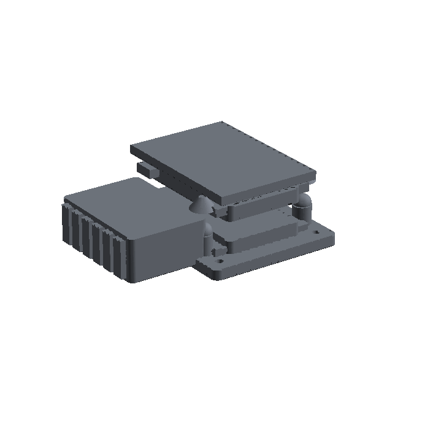

| Front | Top |
|---|---|
| 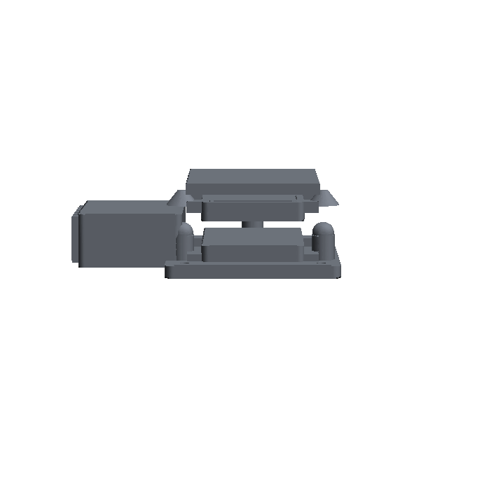 | 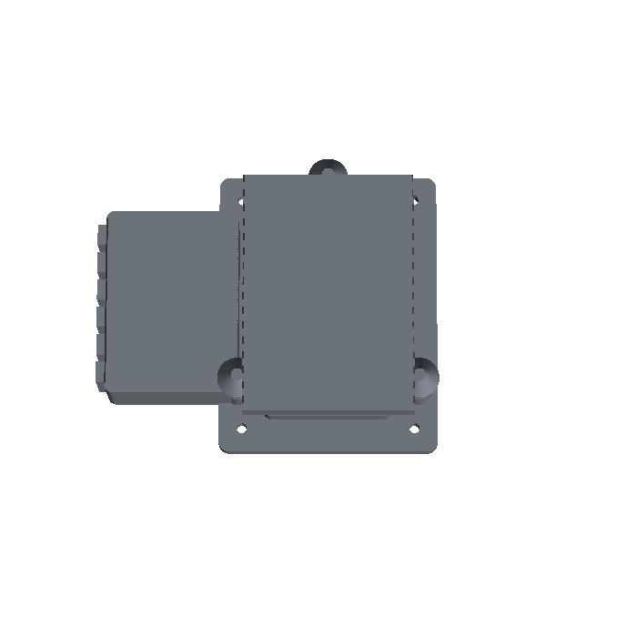 |

Dimensioned isometric line drawing

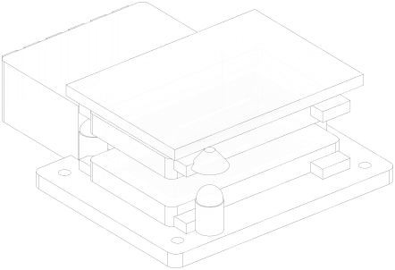

## B — Tapered rails

Two long tapered rails either side of the pad. The lead-in is wide at the top and closes to the running fit at the bottom, so a sloppy approach still lands centred. Capture range is much larger than a kinematic mount and the contact is a line rather than three points, which carries heat and load far better. The cost is that a line contact over-constrains: the fit has to be loose enough for thermal growth, and that looseness is alignment error.

**420.0 × 313.0 × 167.85 mm** · 8,786,468 mm³ · ~12,301 g at 1.4 g/cm³ · model: `concepts/locate_tapered_rails.py`

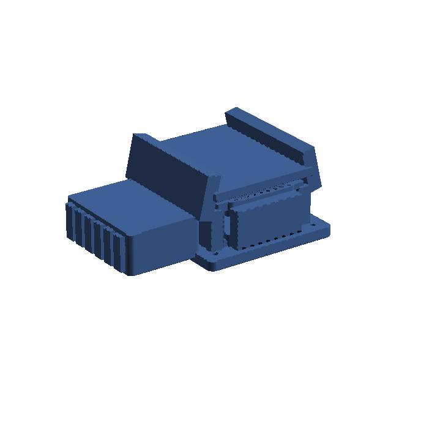

| Front | Top |
|---|---|
| 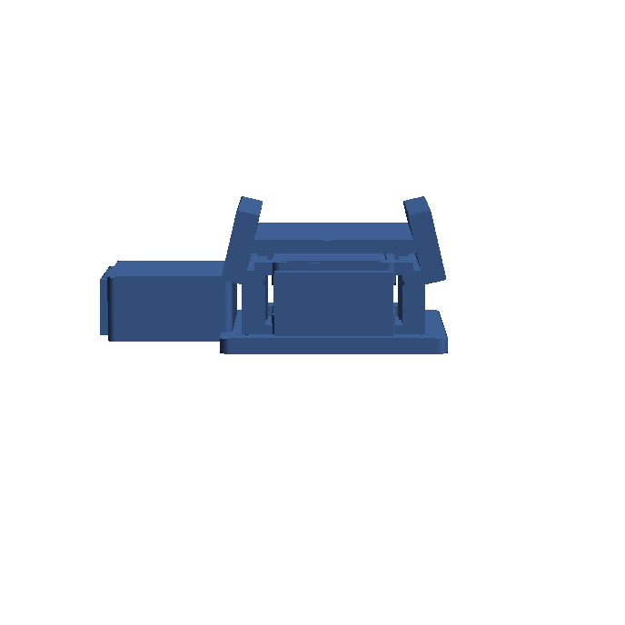 | 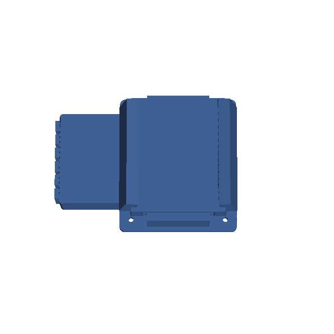 |

Dimensioned isometric line drawing

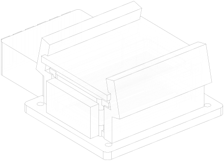

## C — Perimeter nest

The receiver housing drops into a shallow pocket sized to it, with a lead-in chamfer the whole way round. Nothing protrudes above the deck bracket, so there is nothing to snag a line or bend in handling, and the full perimeter carries load and heat. It is the most over-constrained of the three -- the clearance has to absorb the tolerance stack of the whole pocket, so it aligns less precisely than either alternative, and it holds silt and water.

**438.0 × 353.0 × 133.0 mm** · 8,612,814 mm³ · ~12,058 g at 1.4 g/cm³ · model: `concepts/locate_nest.py`

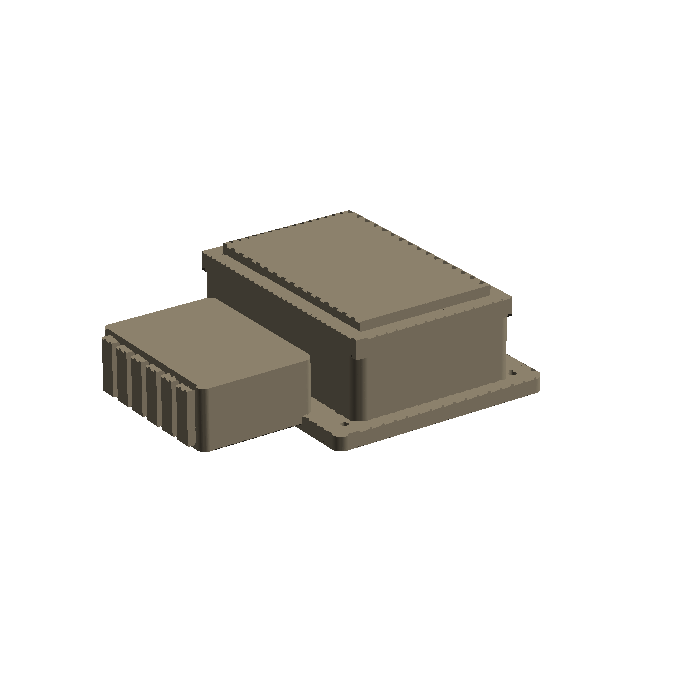

| Front | Top |
|---|---|
| 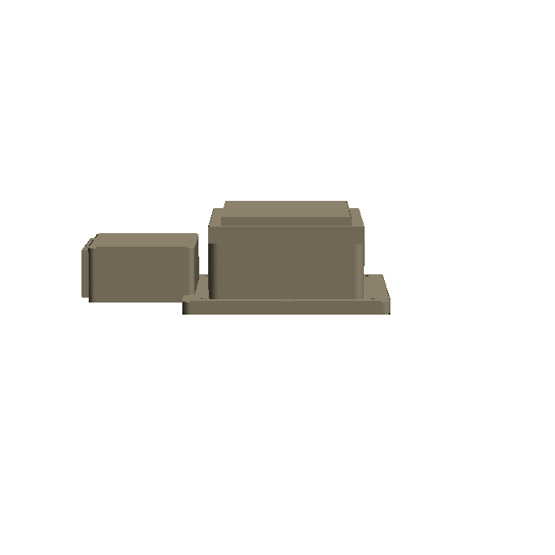 | 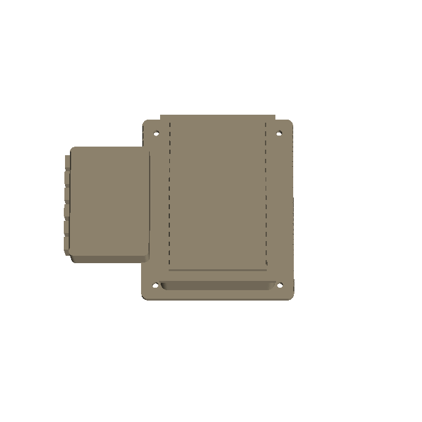 |

Dimensioned isometric line drawing

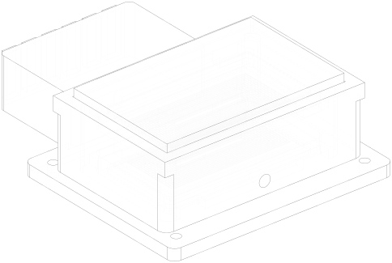

## What v2 keeps from v1

The two-stage resonance tracking — a static frequency sweep that lands near
resonance, then a hill-climb that converges — is the one thing the white paper
actually demonstrated on a bench, and it should survive intact. The firmware
underneath it needs work (thirteen findings in the baseline, five of which
change behaviour on hardware), but the control architecture is sound.

## What is still open

* Cell charge acceptance for the present 48 V / 33 Ah pack — sets the maximum
  rate that may actually be commanded today, and needs the pack datasheet.
* Whether bidirectional operation is required at all. The DAB is bidirectional;
  nothing in the brief asks the Mako to export power. If it is not needed, the
  HV side simplifies considerably.
* The dock and vehicle ambient temperature, which sets what "conduction to
  chassis" is actually worth in °C/W.
