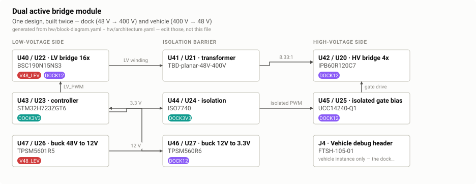
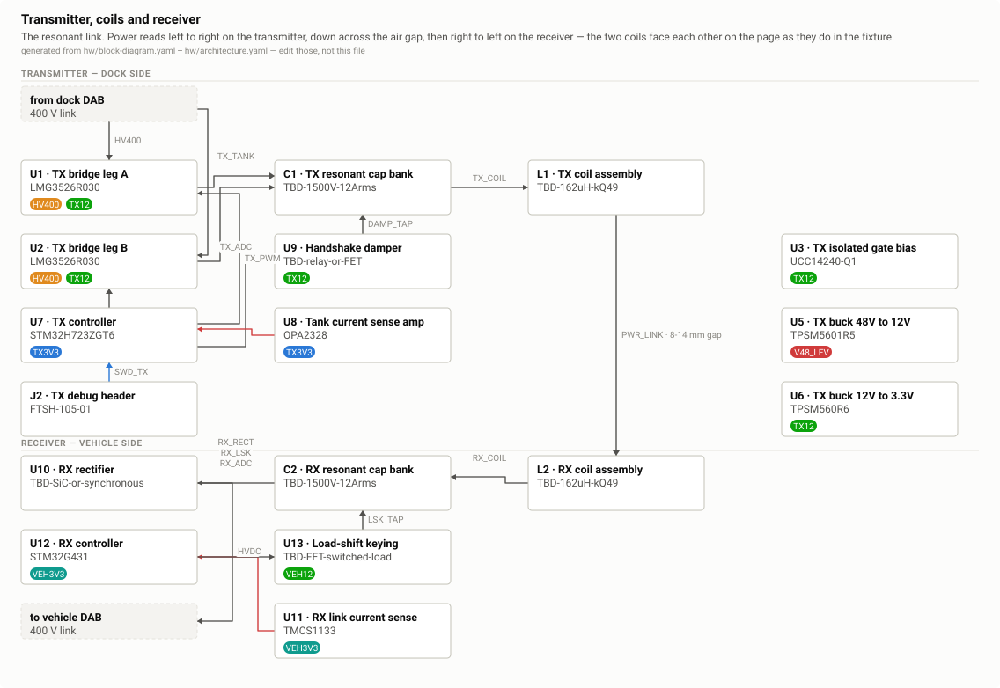
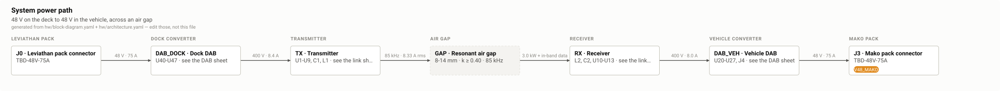
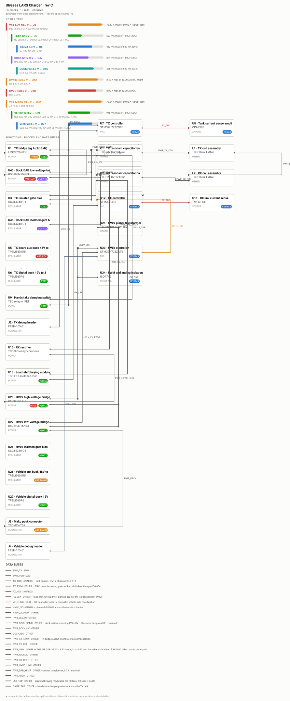

# Review — Architecture — three modular sheets

`arch` · requested 2026-08-31 · branch `claude/wireless-charging-design-hf0aix`

Rebuilt 2026-08-31 after you rejected two attempts, and again after you reported seeing only one diagram here. Two separate faults. The layout: you were right that the column grid was the problem, not just the collisions. The generator put eight of ten blocks in one column, routed buses through boxes, and drew the dual active bridge twice because the master spec instantiates it twice. The sheets are now drawn on a stage grid — stages run left to right in the direction power flows, and every vertical run happens in a gutter that is empty by construction, so a wire cannot cross a box. That is asserted geometrically on every render: all three sheets report zero crossings. Each sheet is also held under 1160 px, because this page scales a wider one down bodily and a 2120 px sheet arrived with 6 px text. The page: the standard architecture tab is hardcoded to a single figure and never read the artefact list I sent for review, which is why you saw one diagram. It is replaced by a configured tab carrying all four, with the rail budget preserved as a table.

## What you are agreeing to

**arch-dab.svg**



**arch-link.svg**



**arch-system.svg**



**block-diagram.svg**



## For context

Sources and working files. Not part of the agreement — these change as work goes on, and changing them does not invalidate your sign-off.

| File | Opens in |
|---|---|
| [hw/architecture.yaml](https://github.com/Harwasch/makehardware_Test/blob/claude/wireless-charging-design-hf0aix/hw/architecture.yaml) | plain text on GitHub |
| [hw/block-diagram.yaml](https://github.com/Harwasch/makehardware_Test/blob/claude/wireless-charging-design-hf0aix/hw/block-diagram.yaml) | plain text on GitHub |

## What we need decided

1. Do the three sheets read now — the system power path, the DAB drawn once, and the TX/coils/RX chain with the coils facing each other?
2. The dock DAB has no debug header where the vehicle instance has J4. If it is one design built twice, that asymmetry is a defect in the master spec. Should I add one?
3. V48_LEV and V48_MAKO both sit at 95% of the 80 A their connectors can deliver. I would rather size the connectors up now than find it at layout. Do you want that?

## Decision

**Not yet reviewed — this is waiting on you.**

Answer in the Claude session that sent you this link. There is nothing to run and nothing to sign here.

Say which option you want **and why**: the reason is worth more than the choice, and it is what gets re-read later when a number has to move. If something is wrong, say what would be right.

**How the answer gets recorded**

The agent writes your decision, in your words, into [`docs/review/reviews.yaml`](https://github.com/Harwasch/makehardware_Test/blob/claude/wireless-charging-design-hf0aix/docs/review/reviews.yaml):

```bash
review-gate sign arch --approve --by <name> --note "..."
review-gate sign arch --changes "what to change"
```

Until that happens, any chunk of work depending on this review cannot be marked done.

---

<sub>Generated by `review-gate`. The sign-off record is [`docs/review/reviews.yaml`](https://github.com/Harwasch/makehardware_Test/blob/claude/wireless-charging-design-hf0aix/docs/review/reviews.yaml).</sub>
