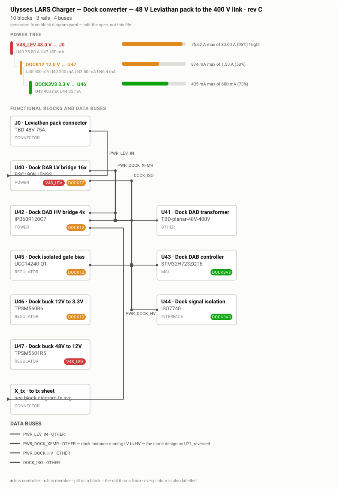
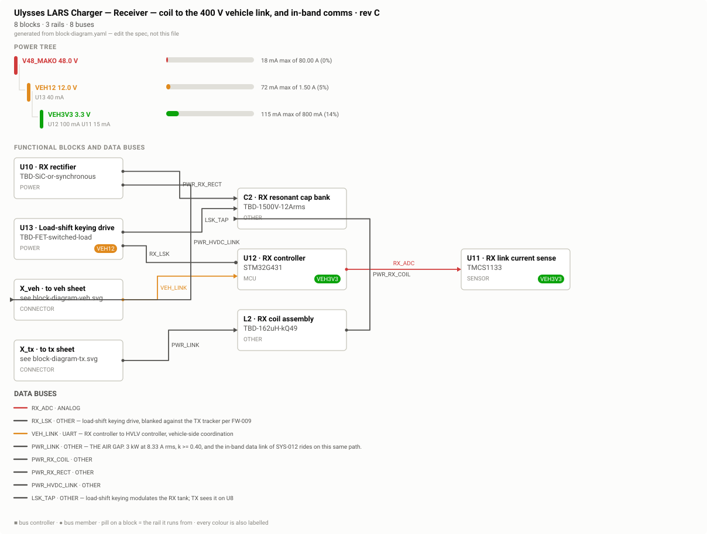
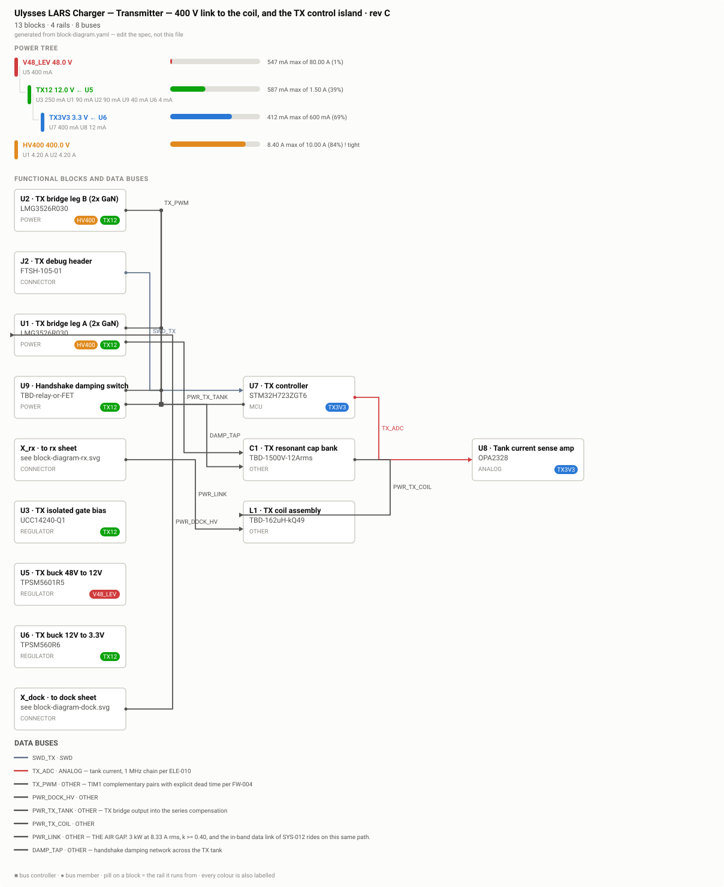
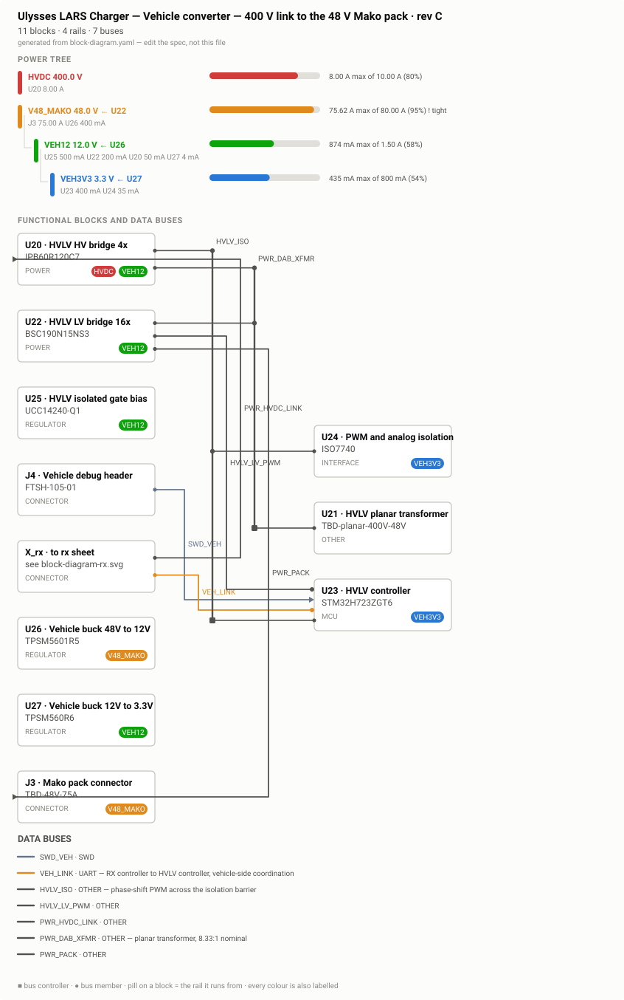

# Review — Architecture — 36 blocks on four readable sheets, 10 rails

`architecture` · requested 2026-08-31 · branch `claude/wireless-charging-design-hf0aix`

Re-opened 2026-08-31. The previous architecture packet embedded a diagram with eight overlapping block pairs, which you spotted. Root cause: the generator pins the layout to hand positions read back out of the .drawio and never tests them for collisions, so when rev C added the seven dock-DAB blocks the pre-existing twenty-nine stayed at their old coordinates and eight pairs landed on top of each other — and block-diagram --check exited 0 on it. Fixed by a fresh layout. Fourteen block names were also being cut mid-word at 24 characters and have been shortened in the spec. Beyond that, 36 blocks and 23 buses do not fit one readable sheet, so the master spec now carries a sheet: tag per block and scripts/block_sheets.py derives four subsystem views from it — dock converter, transmitter, receiver, vehicle converter — with stub connectors where a signal leaves the sheet. The master stays the single source of truth, so the power budget still rolls up across the whole system. Every sheet is checked for overlapping boxes, which is what the gate was missing.

## What you are agreeing to

**block-diagram-dock.svg**



**block-diagram-rx.svg**



**block-diagram-tx.svg**



**block-diagram-veh.svg**



**block-diagram.svg**


## For context

Sources and working files. Not part of the agreement — these change as work goes on, and changing them does not invalidate your sign-off.

| File | Opens in |
|---|---|
| [hw/block-diagram.yaml](https://github.com/Harwasch/makehardware_Test/blob/claude/wireless-charging-design-hf0aix/hw/block-diagram.yaml) | plain text on GitHub |

## What we need decided

1. Are the four sheets the right division — dock converter, transmitter, receiver, vehicle converter?
2. V48_LEV and V48_MAKO both sit at 95% of the 80 A their connectors can deliver. That is tight enough that I would rather size the connectors up now than discover it at layout. Do you want that?
3. HV400 is at 84% of 10 A. Same question, less urgently.

## Decision

**Not yet reviewed — this is waiting on you.**

Answer in the Claude session that sent you this link. There is nothing to run and nothing to sign here.

Say which option you want **and why**: the reason is worth more than the choice, and it is what gets re-read later when a number has to move. If something is wrong, say what would be right.

**How the answer gets recorded**

The agent writes your decision, in your words, into [`docs/review/reviews.yaml`](https://github.com/Harwasch/makehardware_Test/blob/claude/wireless-charging-design-hf0aix/docs/review/reviews.yaml):

```bash
review-gate sign architecture --approve --by <name> --note "..."
review-gate sign architecture --changes "what to change"
```

Until that happens, any chunk of work depending on this review cannot be marked done.

---

<sub>Generated by `review-gate`. The sign-off record is [`docs/review/reviews.yaml`](https://github.com/Harwasch/makehardware_Test/blob/claude/wireless-charging-design-hf0aix/docs/review/reviews.yaml).</sub>
