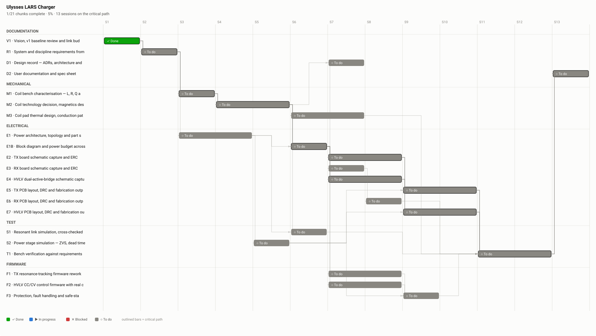

# Review — Project plan — 27 chunks, 16 sessions on the critical path

`plan` · requested 2026-08-31 · branch `claude/wireless-charging-design-hf0aix`

The work as I understand it, with dependencies. No chunk requires laboratory access; bench verification is held as T2, blocked, rather than deleted. The two things worth your eye are whether this is all the work — test, documentation and manufacturing are what people forget — and whether the order is right, since you know constraints I do not.

## What you are agreeing to

**plan.svg**



| File | Opens in |
|---|---|
| [docs/plan.md](https://github.com/Harwasch/makehardware_Test/blob/claude/wireless-charging-design-hf0aix/docs/plan.md) | renders on GitHub |

## For context

Sources and working files. Not part of the agreement — these change as work goes on, and changing them does not invalidate your sign-off.

| File | Opens in |
|---|---|
| [plan.yaml](https://github.com/Harwasch/makehardware_Test/blob/claude/wireless-charging-design-hf0aix/plan.yaml) | plain text on GitHub |

## What we need decided

1. Is this all the work, or is a whole lane missing?
2. Is the order right — anything with a lead time that should start sooner?

## Decision

**Not yet reviewed — this is waiting on you.**

Answer in the Claude session that sent you this link. There is nothing to run and nothing to sign here.

Say which option you want **and why**: the reason is worth more than the choice, and it is what gets re-read later when a number has to move. If something is wrong, say what would be right.

<details><summary>How the answer gets recorded</summary>

The agent writes your decision, in your words, into [`docs/review/reviews.yaml`](https://github.com/Harwasch/makehardware_Test/blob/claude/wireless-charging-design-hf0aix/docs/review/reviews.yaml):

```bash
review-gate sign plan --approve --by <name> --note "..."
review-gate sign plan --changes "what to change"
```

Until that happens, any chunk of work depending on this review cannot be marked done.

</details>

---

<sub>Generated by `review-gate`. The sign-off record is [`docs/review/reviews.yaml`](https://github.com/Harwasch/makehardware_Test/blob/claude/wireless-charging-design-hf0aix/docs/review/reviews.yaml).</sub>
