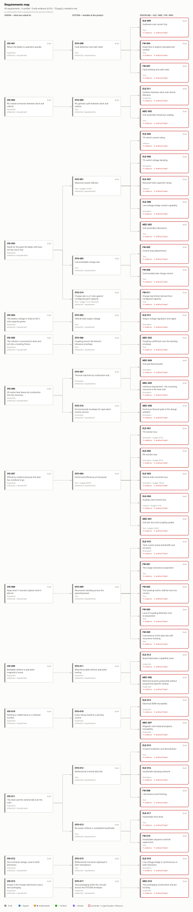

# Review — Requirements — 66 requirements, 0% verified

`requirements` · requested 2026-08-31 · branch `claude/wireless-charging-design-hf0aix`

VIS through SYS to ELE/MEC/FW, with SYS-004 dividing 300 W of loss among five children that sum exactly to the parent. Coverage is 0% verified and that is correct — no design artefact exists yet, so every gap is a missing evidence pointer rather than a defect. Nothing has been marked Verified to improve the number. What I need is your eye on the numbers themselves.

## What you are agreeing to

**requirements-map.svg**



## For context

Sources and working files. Not part of the agreement — these change as work goes on, and changing them does not invalidate your sign-off.

| File | Opens in |
|---|---|
| [requirements/00-vision.sdoc](https://github.com/Harwasch/makehardware_Test/blob/claude/wireless-charging-design-hf0aix/requirements/00-vision.sdoc) | StrictDoc source |
| [requirements/10-system.sdoc](https://github.com/Harwasch/makehardware_Test/blob/claude/wireless-charging-design-hf0aix/requirements/10-system.sdoc) | StrictDoc source |
| [requirements/20-electrical.sdoc](https://github.com/Harwasch/makehardware_Test/blob/claude/wireless-charging-design-hf0aix/requirements/20-electrical.sdoc) | StrictDoc source |
| [requirements/20-firmware.sdoc](https://github.com/Harwasch/makehardware_Test/blob/claude/wireless-charging-design-hf0aix/requirements/20-firmware.sdoc) | StrictDoc source |
| [requirements/20-mechanical.sdoc](https://github.com/Harwasch/makehardware_Test/blob/claude/wireless-charging-design-hf0aix/requirements/20-mechanical.sdoc) | StrictDoc source |
| [requirements/README.md](https://github.com/Harwasch/makehardware_Test/blob/claude/wireless-charging-design-hf0aix/requirements/README.md) | renders on GitHub |
| [requirements/hardware.sgra](https://github.com/Harwasch/makehardware_Test/blob/claude/wireless-charging-design-hf0aix/requirements/hardware.sgra) | download |

## What we need decided

1. Are the numbers right — particularly the 3 kW target, the 0.3-0.5C charge policy and the 90% efficiency budget?
2. Is anything missing that you would expect to see as a requirement?

## Decision

**Not yet reviewed — this is waiting on you.**

Answer in the Claude session that sent you this link. There is nothing to run and nothing to sign here.

Say which option you want **and why**: the reason is worth more than the choice, and it is what gets re-read later when a number has to move. If something is wrong, say what would be right.

<details><summary>How the answer gets recorded</summary>

The agent writes your decision, in your words, into [`docs/review/reviews.yaml`](https://github.com/Harwasch/makehardware_Test/blob/claude/wireless-charging-design-hf0aix/docs/review/reviews.yaml):

```bash
review-gate sign requirements --approve --by <name> --note "..."
review-gate sign requirements --changes "what to change"
```

Until that happens, any chunk of work depending on this review cannot be marked done.

</details>

---

<sub>Generated by `review-gate`. The sign-off record is [`docs/review/reviews.yaml`](https://github.com/Harwasch/makehardware_Test/blob/claude/wireless-charging-design-hf0aix/docs/review/reviews.yaml).</sub>
