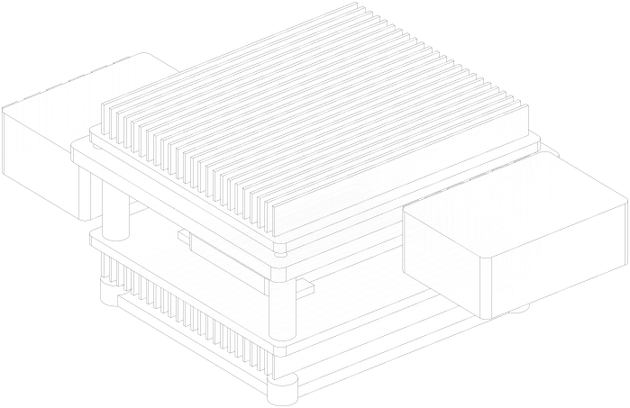
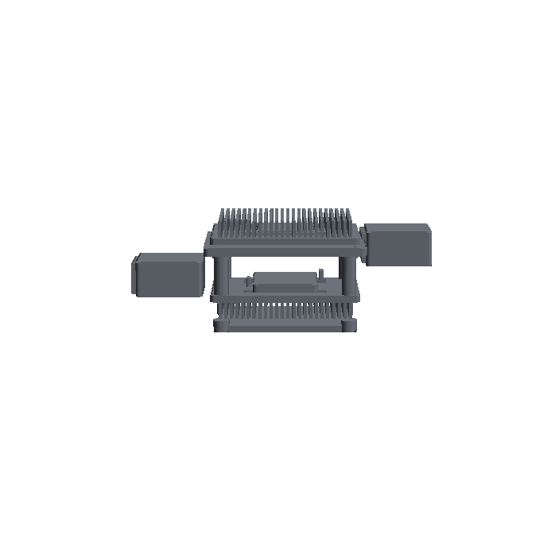
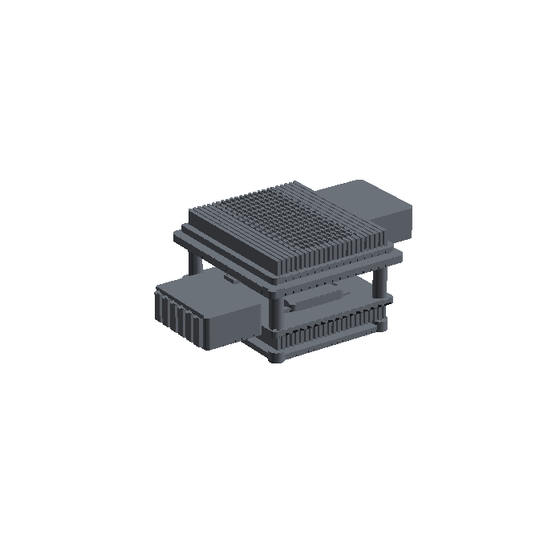
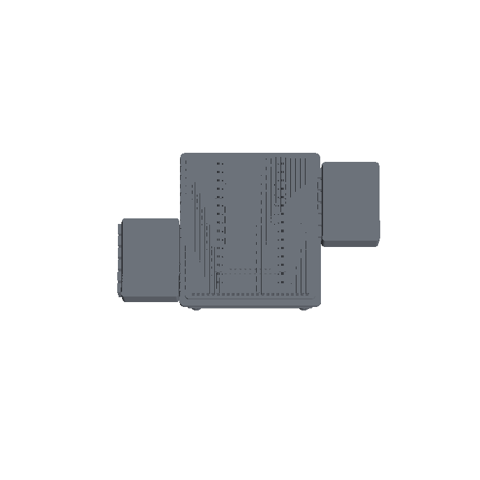

# Review — Vision, scope and the coil decision

`vision` · requested 2026-08-31 · branch `claude/wireless-charging-design-hf0aix`

Re-opened 2026-08-31 after the scope change. Scope is now the charger ELECTRONICS plus a test packaging (VIS-013): integration, the deck fixture and the handling belong to the mechanical team. The three locating concepts you were previously asked to choose between are withdrawn with the fixture, and the locating scheme is set to pins (VIS-005). What replaces them is one concept — a bench rig that holds the coil pair at the SYS-006 envelope so the magnetics can be measured. Read the scope line and the pin decision first; those are the two things this review is really asking about. Note what the scope cut did NOT do: MEC-009, the surface area that cools the pad, was re-aimed as an interface requirement on whoever builds the mount rather than deleted along with the bracket. The coil itself is unchanged and still settled in ADR-0001 as a 16-layer transposed etched PCB.

## What you are agreeing to

**iso.svg**



**view-front.png**



**view-hero.png**



**view-top.png**



| File | Opens in |
|---|---|
| [docs/design/adr-0001-coil-technology.md](https://github.com/Harwasch/makehardware_Test/blob/claude/wireless-charging-design-hf0aix/docs/design/adr-0001-coil-technology.md) | renders on GitHub |
| [docs/design/vision-gallery.md](https://github.com/Harwasch/makehardware_Test/blob/claude/wireless-charging-design-hf0aix/docs/design/vision-gallery.md) | renders on GitHub |
| [docs/design/vision.md](https://github.com/Harwasch/makehardware_Test/blob/claude/wireless-charging-design-hf0aix/docs/design/vision.md) | renders on GitHub |
| [docs/design/vision/manifest.json](https://github.com/Harwasch/makehardware_Test/blob/claude/wireless-charging-design-hf0aix/docs/design/vision/manifest.json) | plain text on GitHub |

## What we need decided

1. Is the scope line right — electronics plus a test rig, with integration and the fixture going to the mechanical team?
2. Pins: two dowels, hole and slot. Is there anything about the real fixture that would make a different interface better?
3. Is 8-14 mm of gap and 5 mm of offset what the fixture can actually hold? This is our assumption about someone else's part and it is the weakest thing in the document.
4. 16 layers at 4 oz is a 64 oz heavy-copper board. Still acceptable, or should I re-open Litz?

## Decision

**Not yet reviewed — this is waiting on you.**

Answer in the Claude session that sent you this link. There is nothing to run and nothing to sign here.

Say which option you want **and why**: the reason is worth more than the choice, and it is what gets re-read later when a number has to move. If something is wrong, say what would be right.

**How the answer gets recorded**

The agent writes your decision, in your words, into [`docs/review/reviews.yaml`](https://github.com/Harwasch/makehardware_Test/blob/claude/wireless-charging-design-hf0aix/docs/review/reviews.yaml):

```bash
review-gate sign vision --approve --by <name> --note "..."
review-gate sign vision --changes "what to change"
```

Until that happens, any chunk of work depending on this review cannot be marked done.

---

<sub>Generated by `review-gate`. The sign-off record is [`docs/review/reviews.yaml`](https://github.com/Harwasch/makehardware_Test/blob/claude/wireless-charging-design-hf0aix/docs/review/reviews.yaml).</sub>
