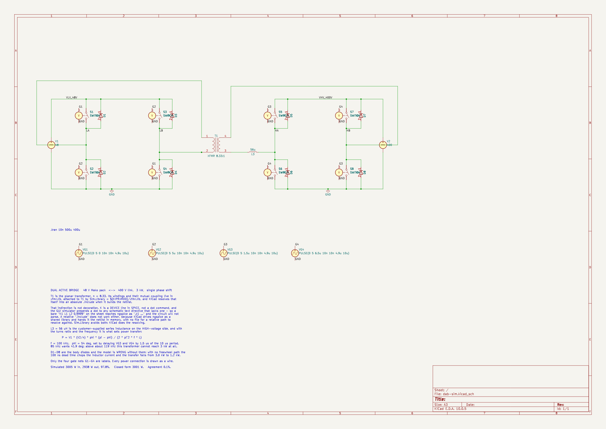

# sim/kicad — the DAB schematic, and how to run it

`dab-sim` is a full dual active bridge — eight switches, their body diodes, the
planar transformer and the customer-supplied 56 µH — drawn as a schematic and
simulated by ngspice. Everything in the power path is a drawn wire, so you can
trace it by eye; only the four gate nets `G1`–`G4` are labels.



---

## Running it on your machine

### 1. What you need

**KiCad 8 or newer.** Built and verified here on **10.0.5**. The simulator is
ngspice, embedded in KiCad:

| Platform | ngspice |
|---|---|
| Windows | bundled with the KiCad installer — nothing to do |
| macOS | bundled with the KiCad `.dmg` — nothing to do |
| Linux | usually pulled in with the `kicad` package via `libngspice0`. If Simulator is greyed out, install `libngspice0` (Debian/Ubuntu) or `libngspice` (Fedora/Arch) and restart KiCad |

Nothing else. No SPICE models to fetch, no libraries to register — every symbol
is a stock KiCad one (`Simulation_SPICE`, `Device`, `power`) and the schematic
carries its own copy of each.

### 2. Open and run

```
git clone <this repo>
kicad sim/kicad/dab-sim.kicad_pro          # or File > Open Project
```

**The Simulator is in the Schematic Editor, not the Project Manager.** Open the
schematic first — double-click `dab-sim.kicad_sch` in the project tree, or press
the Schematic Editor button — and the **Inspect** menu appears. Simulator is
under it.

**Run will ask you for the simulation settings the first time. Give it:**

| Field | Value |
|---|---|
| Analysis | Transient |
| Time step | `10n` |
| Final time | `500u` |
| Time to start saving data | `400u` |

or, if the dialog offers a custom/direct command box, paste
`.tran 10n 500u 400u` into it. KiCad stores the command in the schematic, so it
only asks once.

**Why it asks, when the directive is right there on the sheet.** KiCad treats a
text item as *the simulation command* only when its **first line** starts with a
`.`. The directive block on this sheet reads

```
K1 L1 L2 0.9999          <- first line, does not start with a dot
.tran 10n 500u 400u
```

Both lines are exported into the netlist correctly — the coupling and the
analysis are genuinely there, which is why `run.sh` works — but the GUI does not
recognise the block as a simulation command, so it prompts.

### 3. One edit you must make — the transformer coupling

**Run will then fail with `unimplemented dot command '.k1'`.** This is the same
bug wearing a different hat, and it is worth understanding because it will catch
you again on any transformer.

`K` is a **device** line in SPICE, not a dot command. The GUI simulator prepends
a `.` to any schematic directive that does not already start with one, so
`K1 L1 L2 0.9999` reaches ngspice as `.k1 l1 l2 0.9999` and the circuit does not
parse. `kicad-cli` does **not** do this — which is exactly why `run.sh` produced
correct numbers while the GUI would not run at all.

The fix is one line. In eeschema, double-click the directive text near the
bottom left and change

```
K1 L1 L2 0.9999          →     .include coupling.cir
.tran 10n 500u 400u            .tran 10n 500u 400u
```

`coupling.cir` is already in this folder and holds the `K1` statement. It starts
with a dot, so neither netlister mangles it, and ngspice reads the file and gets
a proper device line. Save, and Run works.

Putting `.include` on the first line also makes the whole block start with a
dot, which is what KiCad wants before it will recognise the `.tran` beneath it —
so this usually cures the settings prompt in step 2 as well.

The analysis settles in a few seconds; it skips the first 400 µs of start-up and
shows the last 100 µs. Expect **3005 W in, 2938 W out, 97.8%**.

### 4. Probing

With the Simulator window open, click a wire in the schematic to add it to the
plot; click a component pin to add its current. The nets worth probing are
already named, so they come up with sensible titles rather than `Net-_D1-A_`:

| Probe this | To see |
|---|---|
| `LA` and `LB` | the low-voltage bridge output — a 48 V square wave |
| `HA` and `HB` | the high-voltage bridge output — 400 V, phase shifted |
| current in **L3** | the tank current in your 56 µH. This is the waveform that matters: trapezoidal, and its slope is the voltage across the inductance |
| current in **V1** | input current from the 48 V pack, about 62.6 A average |
| current in **V2** | output current into the 400 V link, about 7.35 A average |
| `G1`–`G4` | the four gate drives, so you can see the phase shift |

For power rather than current, use the plot's **Add signal → expression** and
enter `v(/LA)*i(L1)` or similar.

### 5. Moving the operating point

Phase shift is the control input, and it is set by **when the high-voltage
bridge switches relative to the low-voltage one** — the delay field in `VG3`
and `VG4`. At 100 kHz the period is 10 µs, so 1 µs of delay is 36°.

| Want | Set VG3 delay | and VG4 delay |
|---|---|---|
| 54° — 3.0 kW, the shipped setting | `1.5u` | `6.5u` |
| 30° — less power, lowest current | `0.833u` | `5.833u` |
| 90° — maximum power, worst current | `2.5u` | `7.5u` |

Keep VG4 exactly 5 µs after VG3: they are the two halves of the same bridge.

To change frequency, every `10u` period and `4.9u` width in all four gate
sources has to move together, and the delays with them. **Above about 119 kHz
this transformer cannot reach 3 kW at any phase shift** — 56 µH is the limit.

### 6. Headless

Same schematic, same ngspice, no clicking:

```bash
./sim/kicad/run.sh              # measurements and a waveform plot
./sim/kicad/run.sh --no-plot    # measurements only, no matplotlib needed
```

It exports the netlist from the schematic with `kicad-cli`, swaps the `.tran`
for a `.control` block that also measures, runs it, and prints:

```
  input from the 48 V pack     3005.3 W   (62.61 A)
  output into the 400 V link   2938.4 W   (7.346 A)
  efficiency                     97.8 %
  tank current, HV side          9.51 A rms   11.42 A peak

  closed form for these values: 3001 W.  Deviation 0.1%.
```

Those are the numbers to expect from a clean run. If yours differ, something
changed. `PYTHON=/path/to/python ./run.sh` if the default interpreter has no
matplotlib.

---

## What the circuit is

`L1` / `L2` are the planar transformer, n = 8.33 so `L2 = L1 · n²`, coupled by
`K1` at 0.9999 — which makes `L3` the only leakage, deliberately, because `L3`
**is** the customer's 56 µH series inductance on the high-voltage side. That
inductance, the turns ratio and the frequency are what set power transfer:

```
P = V1 · (V2/n) · φ · (π − φ) / (2 · π² · f · L)
```

`D1`–`D8` are the body diodes, and **the model is wrong without them**: with no
freewheel path the 100 ns dead time chops the inductor current and the transfer
falls from 3.0 kW to 1.2 kW. That is measured, not asserted.

## Things that will bite you if you edit this sheet

**`Sim.*` properties must be on the symbol instance, not just the library.** A
symbol placed programmatically carries only Reference/Value/Footprint/Datasheet,
and the netlist then exports `S1 __S1` — no nodes, no model, and a run that
produces zero data rows. Every simulated part here carries `Sim.Device`,
`Sim.Pins` and `Sim.Params` as instance properties for that reason.

**Do not draw a rail straight across a row of switches.** The `SWITCH` symbol
puts its control pins at the same heights as its power pins, one grid column to
the left, so a horizontal rail through a switch row passes through every `C+`
pin and shorts the supply to the gate net. ngspice says `singular matrix: check
node vg2#branch` and returns nothing. The rails here run above and below the
switch rows with short stubs down to each pin — that is why the top rail sits at
y = 68.58 rather than on the pin row.

**One ERC error is expected.** `power_pin_not_driven` on the GND symbols: KiCad
wants a `PWR_FLAG`, which matters for a board and not for a simulation. The
other ERC warnings you may see are library-table complaints that only appear if
`Simulation_SPICE`, `Device` or `power` are not in your global library table —
on a normal KiCad install they are.

## What this deck does not do

No switching loss, no ZVS, no parasitics, no thermal. The switches are ideal
with a 5 mΩ on-resistance and the diodes are generic. That is chunk `S2`, and it
needs real device models — the BSC190N15NS3 and IPB60R120C7 datasheets are still
listed as blocked in `docs/reference/manifest.yaml`.

The companion hand-written decks in `sim/link` and `sim/dab` cover the resonant
link and the phase-shift sweep. Findings from all of them are in
[`docs/design/sim-findings.md`](../../docs/design/sim-findings.md).
